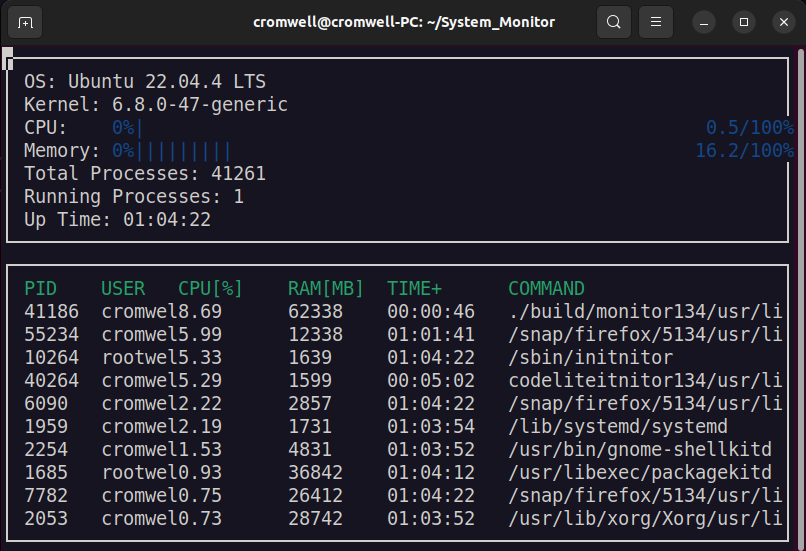

# System Monitor
(Based on the [Udacity C++ Nanodegree Program](https://www.udacity.com/course/c-plus-plus-nanodegree--nd213))<br>
System monitor for Linux-based systems, simplified version of htop.



## Environment
Current application has been built on:

* Ubuntu 22.04
* C++ v17
* gcc v11.4

## ncurses
[ncurses](https://www.gnu.org/software/ncurses/) is a library that facilitates text-based graphical output in the terminal. This project relies on ncurses for display output.

To install ncurses within your own Linux environment:<br>
`sudo apt install libncurses5-dev libncursesw5-dev`

## Basic Build Instructions

1. Clone this repo:
```sh
 cd ~
 git clone https://github.com/cr0mwell/System_Monitor.git
```
2. Build: `cd System_Monitor && make build`
3. Run: `./build/monitor`